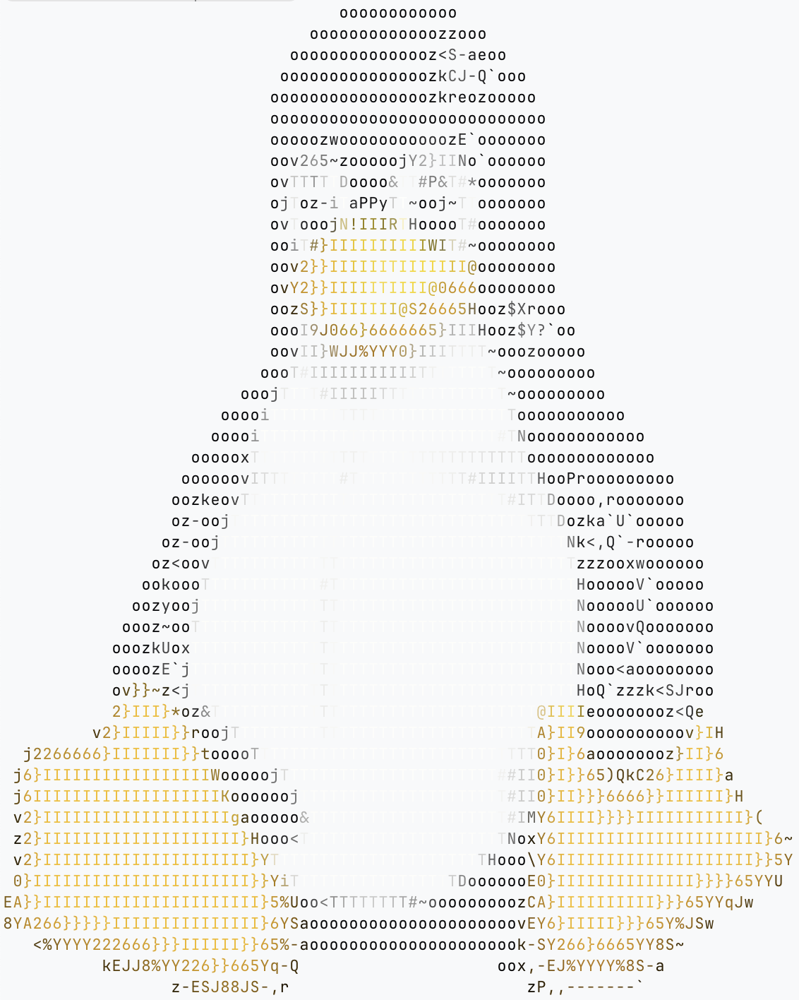

# ASCII Renderer

High-quality ASCII art renderer using shape-based character matching.



## Attribution

This is a Python implementation of the technique described by **Alex Harri** in his excellent blog post:

> **[ASCII characters are not pixels: a deep dive into ASCII rendering](https://alexharri.com/blog/ascii-rendering)**

The core insight is that ASCII characters have *shape*, not just density. By capturing each character's shape as a 6D vector and matching against sampled image regions, we get much sharper results than traditional density-based approaches.

## Installation

```bash
git clone https://github.com/mayz/ascii-renderer.git
cd ascii-renderer
uv sync
```

For faster lookups with scipy KDTree (optional):

```bash
uv sync --extra fast
```

## Usage

```bash
# Basic usage
uv run ascii-render image.png

# Wider output
uv run ascii-render image.png --width 120

# Sharper edges (good for logos, line art, shapes)
uv run ascii-render image.png --global-contrast 2.5 --edge-contrast 3.0

# Colored output (24-bit true color)
uv run ascii-render image.png --color

# For dark terminal backgrounds
uv run ascii-render image.png --invert

# Classic ASCII art charset
uv run ascii-render image.png --charset " .:-=+*#%@"

# Save to file
uv run ascii-render image.png --output art.txt
```

## Options

| Option | Short | Default | Description |
|--------|-------|---------|-------------|
| `--width` | `-w` | 80 | Output width in characters |
| `--global-contrast` | `-g` | 1.0 | Global contrast enhancement (try 2-4 for sharper) |
| `--edge-contrast` | `-e` | 1.0 | Directional edge contrast (try 2-4 for sharper edges) |
| `--sample-quality` | `-q` | 16 | Samples per circle (higher = slower but better) |
| `--aspect` | `-a` | 0.5 | Character aspect ratio width/height |
| `--charset` | `-c` | printable ASCII | Custom character set |
| `--invert` | `-i` | off | Invert luminance (for dark backgrounds) |
| `--color` | `-C` | off | Enable 24-bit true color output |
| `--output` | `-o` | stdout | Output file path |

## Color Output

The `--color` flag enables 24-bit ANSI true color output. Each character is colored based on the average color of its corresponding image region.

```bash
# Basic colored output
uv run ascii-render photo.png --color

# Colored with contrast enhancement
uv run ascii-render photo.png --color -g 2.5 -e 3.0

# Save colored output (ANSI codes preserved in file)
uv run ascii-render photo.png --color -o art.txt
cat art.txt  # Will show colors when displayed in terminal
```

**Terminal compatibility**: Works with modern terminals that support 24-bit color (ghostty, iTerm2, kitty, Windows Terminal, most Linux terminals). The ANSI escape codes use the format `\x1b[38;2;R;G;Bm`.

## How It Works

Traditional ASCII renderers treat each character as a single brightness value - darker characters like `@` for bright regions, lighter ones like `.` for dark regions. This ignores that characters have *shape*.

This renderer:

1. **Generates shape vectors**: Each ASCII character is rendered and sampled with 6 circles in a 2x3 grid, producing a 6D vector that captures where the ink is located

2. **Samples the image**: Each grid cell in the input image is sampled the same way, producing a 6D vector

3. **Finds the best match**: The character whose shape vector is closest (Euclidean distance) to the sampled vector is chosen

4. **Enhances contrast** (optional): Two techniques sharpen edges:
   - *Global contrast*: Exaggerates differences within each cell
   - *Directional contrast*: Uses samples from neighboring cells to sharpen boundaries

## Examples

```bash
# Photos with smooth gradients - use defaults
uv run ascii-render photo.jpg

# Logos or line art - crank up contrast
uv run ascii-render logo.png -g 4.0 -e 4.0 --charset " .oO@"

# Large detailed output
uv run ascii-render image.png -w 150 -q 32 -o output.txt
```

## License

MIT License - see [LICENSE](LICENSE) file.
